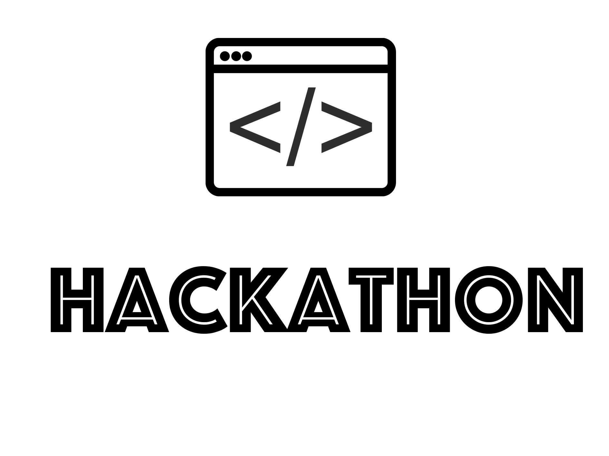

<h1 align="center"> Hackathon Timer 
<a href="">VinHack</a> - <a href="">VinnovateIT</a></h1>
<h2 align="center"> A timer for Hackathon with <a href="">GitHub Live Updates</a>.  Made this for <a href="">VinHack</a> - a hackathon by <a href="">VinnovateIT</a></h2>

<h3 align="center">About VinHack</h3>

<a href="">VinHack</a> was a hackathon ogranized by <a href="">VinnovateIT</a> at <a href="">VIT Vellore</a>. The organizing team was led by <a href="">Shreya Anand</a>, President of <a href="">VinnovateIT</a>. I had honour of being a member of <a href="">judge</a> panel. That was great experience for me. 
  
My contribution includes :
  
  <strong>
  <ul>
    <li>Monitoring the development of <a href="">website</a></li>
    <li>Developed <a href="">go to place</a> for the participants</li>
    <li>Created <a href="">quiz contest</a> for the participants</li>
    <li>Made <a href="">problem statements</a></li>
  </ul>

</strong>

This is basic timer which I've made for [VinHack](). It shows the notifications for the commits made on [VinnovateIT GitHub Organization](). This helps in boosting the energy of participants. If you're organizing a hackathon, you can use this! Just change the the url below with your organization's `url` and here you go!

